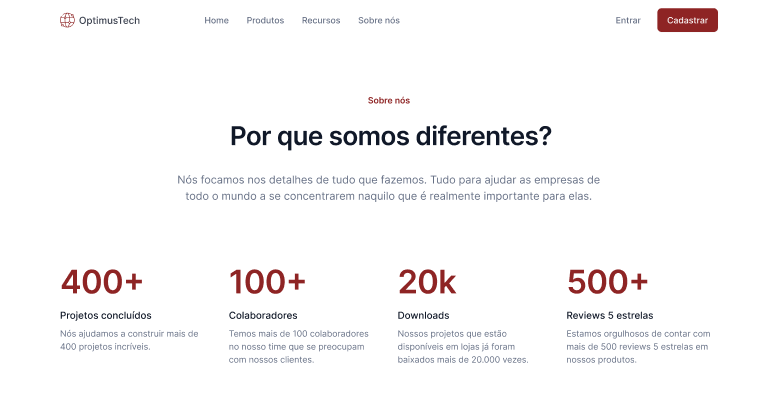
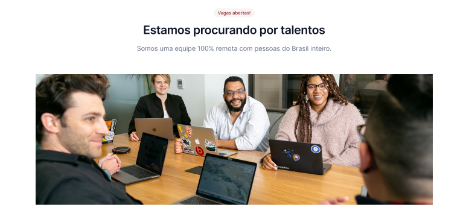
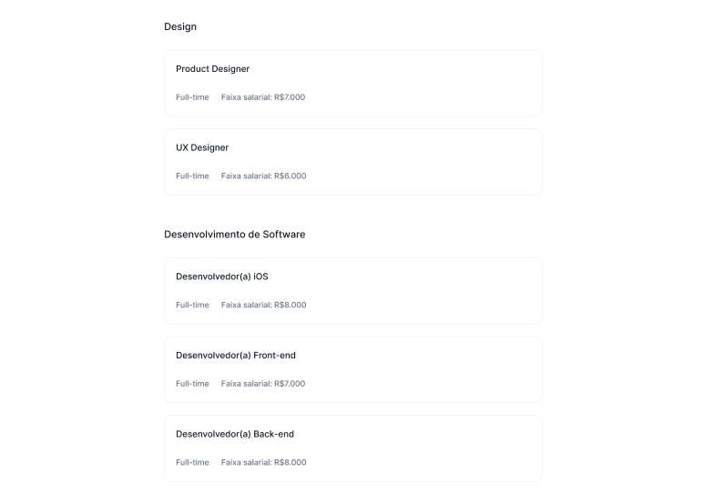
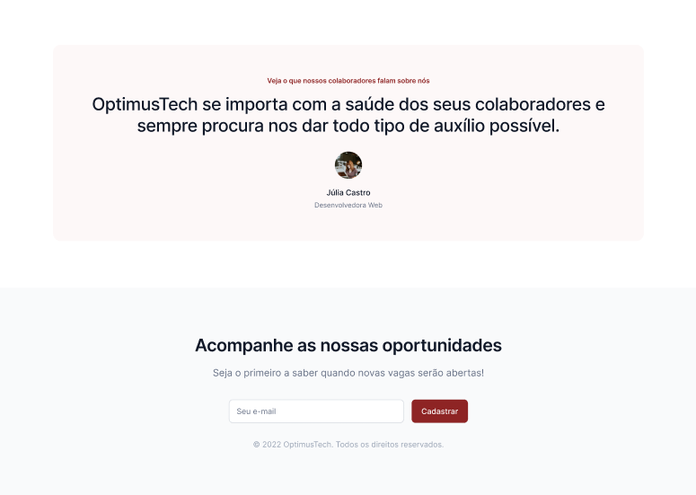

<h1 align="center">#7DaysOfCode - OptimumTech</h1>

 Desafio de 7 dias realizado pela Alura após finalização do curso de HTML/CSS para prática dos conceitos estudados em aula.  

  <a href="#-tecnologias">Tecnologias</a>&nbsp;&nbsp;&nbsp;|&nbsp;&nbsp;&nbsp;
  <a href="https://github.com/gabriel-adsv/optimum-tech">Projeto</a>&nbsp;&nbsp;&nbsp;|&nbsp;&nbsp;&nbsp;
  <a href="https://gabriel-adsv.github.io/optimum-tech/" target="_blank">Layout</a>&nbsp;&nbsp;&nbsp;|&nbsp;&nbsp;&nbsp;
  <a href="#memo-licença">Licença</a>

  

 

  
  
  
  

## 🚀 Tecnologias
- HTML
- CSS
- JavaScript

## 💻 Projeto
Projeto feito com a finalidade de práticar conceitos de CSS como responsividade, z-index, flexbox, grid. E também alguns conceitos de JavaScript praticados à partir da implementação de um Dark Mode.
- [Acesse o projeto finalizado, online](https://gabriel-adsv.github.io/optimum-tech/)

## 📝 Licença
Esse projeto está sob a licença MIT.

---
Feito com ♥ by Gabriel Augusto